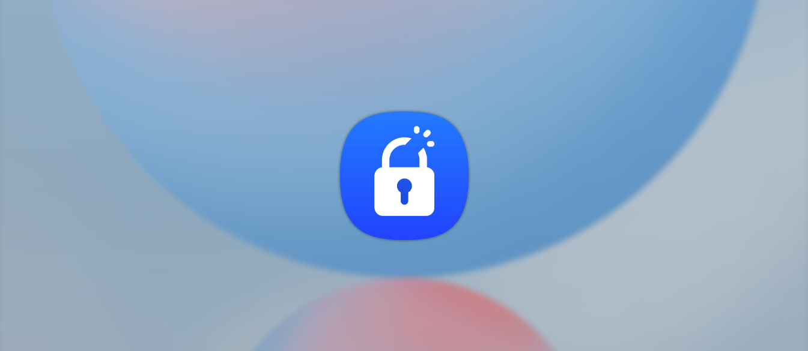
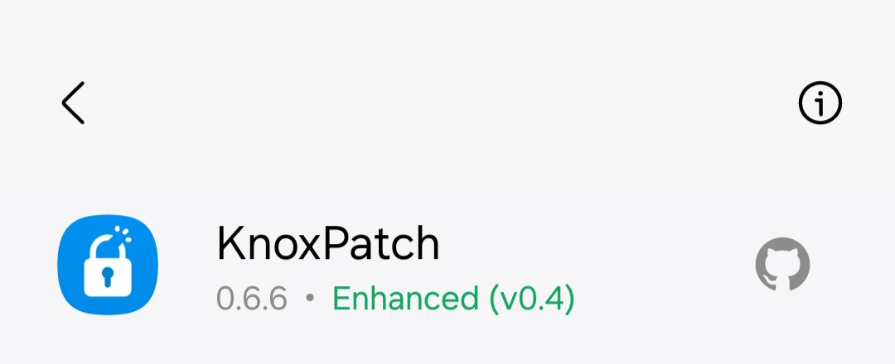

<p align="center">
  
  <br><br>
  
  
  
  
  
  
  
  <br><br>
  An <a href="https://github.com/LSPosed/LSPosed">LSPosed</a> module to get Samsung apps/features working again in your rooted Galaxy device.
  <br><br>
  Any form of contribution, suggestions, bug report or feature request for the project will be welcome.
  <br>
</p>

## Supported Android versions
- Android 9 (One UI 1.x)
- Android 10 (One UI 2.x)
- Android 11 (One UI 3.x)
- Android 12 (One UI 4.x)
- Android 12L (One UI 4.1.1)
- Android 13 (One UI 5.x)

## Supported apps
- ➖ [Galaxy Wearable (Gear Manager)](https://www.samsung.com/us/support/owners/app/galaxy-wearable-watch) ([Enhancer](#knoxpatch-enhancer) required)
- ✅ [Samsung Flow](https://www.samsung.com/uk/apps/samsung-flow/)
- ✅ [Samsung Health](https://www.samsung.com/uk/apps/samsung-health/)
- ✅ [Samsung Health Monitor](https://www.samsung.com/uk/apps/samsung-health-monitor/)
- ✅ [Secure Folder](https://www.samsungknox.com/en/solutions/personal-apps/secure-folder) *
- ✅ [Secure Wi-Fi](https://www.samsung.com/uk/support/mobile-devices/what-is-the-secure-wifi-feature-and-how-do-i-enable-or-use-it/)
- ➖ [Smart View](https://www.samsung.com/uk/tvs/tv-buying-guide/what-is-samsung-smart-view/) ([Enhancer](#knoxpatch-enhancer) required)
- ✅ [Private Share](https://www.samsung.com/uk/support/mobile-devices/how-to-keep-your-personal-data-safe-using-private-share/)
- ❌ [Samsung Pass](https://www.samsung.com/uk/apps/samsung-pass/)
- ❌ [Samsung Wallet (Pay)](https://www.samsung.com/uk/apps/samsung-wallet/)

\* Secure Folder might not work properly on devices with One UI 3.x and encrypted data partition.

## KnoxPatch Enhancer

KnoxPatch Enhancer is a [Magisk](https://github.com/topjohnwu/Magisk) module that will take care of the (currently) non-fixable apps/features via the Xposed API's, such as the Galaxy Wearable apps. To install it, download the module zip from the [latest release](https://github.com/BlackMesa123/KnoxPatch/releases/latest) and install it from the "Modules" tab inside the Magisk Manager app. The app will then show an "Enhanced" badge if the module is installed and active:

<p align="center">
  
</p>

## Credits
- Samsung
- [LSPosed Team](https://github.com/LSPosed)
- [YukiHookAPI](https://github.com/fankes/YukiHookAPI)
- [Rikka](https://github.com/RikkaApps)

## Copyright
```
/*
 * Copyright (C) 2022 BlackMesa123
 *
 * This program is free software: you can redistribute it and/or modify
 * it under the terms of the GNU General Public License as published by
 * the Free Software Foundation, either version 3 of the License, or
 * (at your option) any later version.
 *
 * This program is distributed in the hope that it will be useful,
 * but WITHOUT ANY WARRANTY; without even the implied warranty of
 * MERCHANTABILITY or FITNESS FOR A PARTICULAR PURPOSE.  See the
 * GNU General Public License for more details.
 *
 * You should have received a copy of the GNU General Public License
 * along with this program.  If not, see <http://www.gnu.org/licenses/>.
 */
```

## Stargazers over time
[](https://starchart.cc/BlackMesa123/KnoxPatch)
